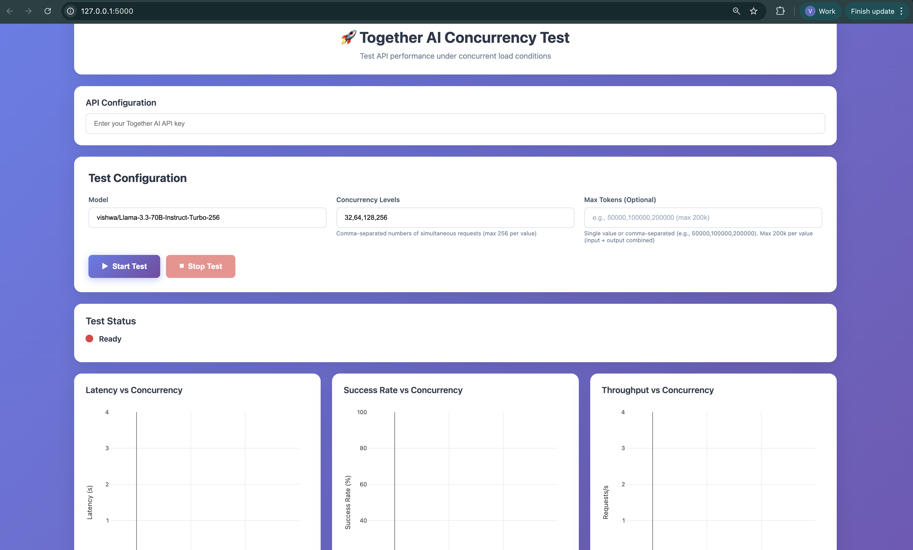
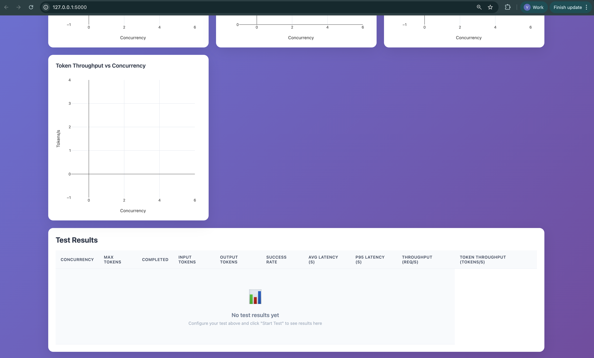

# Together AI Load Benchmark

A performance testing and load analysis tool that helps developers and teams understand Together AI API behavior under concurrent load conditions.
It enables data-driven capacity planning by identifying rate limits, measuring latency degradation, and quantifying throughput at scale.
The tool provides both command-line and web dashboard interfaces to run systematic concurrency tests across multiple load levels and token configurations.
By generating comprehensive metrics including success rates, latency percentiles (P50/P95/P99), and token throughput, it empowers teams to optimize their API integration strategies and make informed scaling decisions.

**Note:** This tool is designed specifically for **text input/output testing** with Together AI's chat completion API. 
It does not support image inputs, embeddings, or other API endpoints yet.

## Features

- **Fast Concurrency Testing** - Test API limits with 32, 64, 128, 256+ concurrent requests
- **Real-time Dashboard** - Web UI with live charts and metrics
- **Comprehensive Metrics** - Latency (P50/P95/P99), throughput, success rates, token counts

## Dashboard Screenshots





## Quick Start

```bash
# 1. Setup
cd together-ai-load-benchmark
source venv/bin/activate
pip install -r requirements.txt

# 2. Set API key (and optionally hide SDK banner)
export TOGETHER_API_KEY="your-api-key-here"
export TOGETHER_NO_BANNER=1  # Optional: hide SDK update banner

# 3. Run test (CLI)
python test.py --concurrency "32,64,128,256"

# OR run dashboard
python dashboard/app.py
# Open http://localhost:5000
```

## Usage

### Command Line

```bash
# Basic test
python test.py --concurrency "32,64,128,256"

# With options
python test.py \
  --model "vishwa/Llama-3.3-70B-Instruct-Turbo-256" \
  --concurrency "32,64,128,256,512" \
  --max-tokens 2000 \
  --output my_results
```

**Options:**
- `--model` - Model name (default: Llama-3.3-70B-Instruct-Turbo-256)
- `--concurrency` - Comma-separated levels (e.g., "32,64,128,256")
- `--max-tokens` - Max output tokens (optional)
- `--output` - Output file prefix (default: "results")

**Output:**
- `results.json` - Complete metrics
- Console output with real-time progress

### Web Dashboard

```bash
python dashboard/app.py
```

Then navigate to `http://localhost:5000`

**Features:**
- Configure tests via web form
- 4 real-time charts (latency, success rate, throughput, token throughput)
- Live progress tracking
- Results table with sortable columns
- Helpful tooltips on all fields

## Metrics

For each concurrency level:

| Metric | Description |
|--------|-------------|
| Success Rate | % of successful requests |
| Avg Latency | Mean response time |
| P50/P95/P99 | Latency percentiles |
| Min/Max | Latency range |
| Throughput | Requests per second |
| Token Throughput | Total tokens per second |

## Project Structure

```
together-ai-load-benchmark/
├── test.py              # Main CLI test script
├── dashboard/           # Web dashboard
│   ├── app.py          # Flask + SocketIO server
│   └── templates/      # HTML/JS frontend
├── src/                 # Advanced modules
│   ├── test_runner.py  # Full test runner with token matrix
│   ├── config.py       # Configuration management
│   ├── token_generator.py  # Token-based prompt generation
│   └── metrics.py      # Metrics calculation
├── venv/               # Python virtual environment
├── results/            # Test results (JSON)
└── requirements.txt    # Dependencies
```

## Examples

### Find API Limits
```bash
python test.py --concurrency "16,32,64,128,256,512"
```

### Test Specific Model
```bash
python test.py \
  --model "meta-llama/Meta-Llama-3.1-70B-Instruct-Turbo" \
  --concurrency "32,64,128,256"
```

### Control Response Length
```bash
python test.py --concurrency "64,128,256" --max-tokens 1000
```

## Requirements

- Python 3.9+
- Together AI API key
- Dependencies: `together`, `flask`, `flask-socketio`, `numpy`, `matplotlib` (see requirements.txt)

## Installation

```bash
# Clone/navigate to project
cd together-ai-load-benchmark

# Create/activate virtual environment
python3 -m venv venv
source venv/bin/activate  # On Windows: venv\Scripts\activate

# Install dependencies
pip install -r requirements.txt

# Set API key
export TOGETHER_API_KEY="your-key"
```

## Troubleshooting

**Rate limiting (429 errors)?**
- Reduce concurrency: `--concurrency "16,32,64"`

**Missing dependencies?**
- Run: `pip install -r requirements.txt`

**Dashboard not loading?**
- Check port 5000 isn't in use: `lsof -ti:5000`
- Try different browser

**Tests too slow?**
- Use CLI `test.py` instead of full matrix in `src/test_runner.py`
- Start with lower concurrency levels

## Advanced Usage

### Full Token Matrix Testing

For detailed token analysis, use the full test runner:

```bash
python src/test_runner.py \
  --concurrency "32,64" \
  --input-tokens "1000,10000" \
  --output-tokens "1000,10000"
```

This tests all combinations of concurrency × input tokens × output tokens.

**Note:** This is slower (15-30 min) but provides detailed token scaling analysis.

## Contributing

This is a testing tool. Feel free to modify for your needs.

---

**Version:** 0.1
**Last Updated:** December 2025
